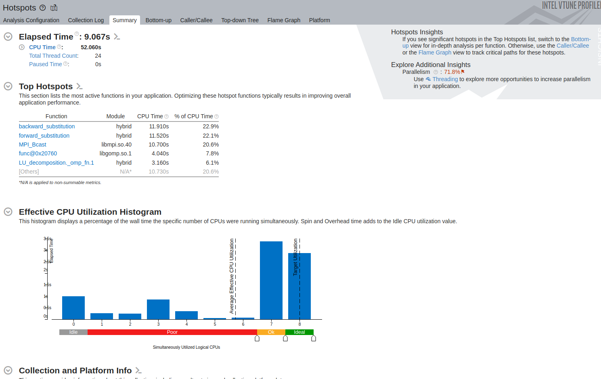

# APP Project - 2024

## Students

- **Dumitru Bianca Stefania** - 343C1
- **Dumitrescu Bogdan** - 343C1

## Coordinator

- **Tudor Calafeteanu**

## Project Description

This program performs LU decomposition on a given square matrix and computes its inverse to demonstrate a practical use case for the decomposition. LU decomposition factors a matrix `A` into the product of a lower triangular matrix `L` and an upper triangular matrix `U`, i.e., `A = L * U`. This decomposition is useful because it simplifies the process of solving systems of linear equations and plays a crucial role in computing the inverse of a matrix.

By solving the system `L * y = e_i` and `U * x = y` for each column of the identity matrix, the inverse is efficiently obtained. The computed inverse can be used in various further calculations.

We also created a checker (check_corectness.py) that verifies the correctness of the computed inverse by checking if `A * A_inv` approximates the identity matrix.

## Time and Space Complexity

### LU Decomposition

- **Time Complexity:** `O(n^3)`

  - The algorithm requires three nested loops to compute each element of the `L` and `U` matrices:

  ```plaintext
  for i in range(0, n):
    for j in range(0, n):
      for k in range(0, i):
        compute L[j][i]
        compute L[i][j]
  ```

- **Space Complexity:** `O(n^2)`
  - We need to store the `L` and `U` matrices.

### Computing the Inverse (from LU Decomposition)

- **Time Complexity:** `O(n^3)`

  - To compute the inverse, we solve `n` systems of 2 linear equations, each with `O(n^2)` complexity.

  ```
  def forward_substitution(l, e, y):
    for i in range(0, n):
      for j in range (0, i):
        compute y[i]

  def backward_substitution(u, y, x):
    for i in range(n-1, 0):
      for j in range (i+1, n):
        compute x[i]

  for i in range(0. n):
    forward_substitution(l, e, y);  // Solve L * y = e
    backward_substitution(u, y, x); // Solve U * x = y
    for j in range(0, n):
      a_inv[j][i] = x[j]
  ```

- **Space Complexity:** `O(n^2)`
  - The space for the `x` and `y` vectors is `O(n)`, and the inverse matrix requires `O(n^2)` space.

## Input Matrices

Three input matrices of different sizes were generated using the `scripts/random_input_generator.py` script:

| Matrix Size | Dimensions  |
| ----------- | ----------- |
| **small**   | 700 x 700   |
| **medium**  | 1100 x 1100 |
| **large**   | 1500 x 1500 |

## Hardware Specifications

- **Processor**: Intel® Core™ i5-1155G7 (4 Cores, 8 Threads)
- **Clock Speeds**:
  - Base: 2.50 GHz (TDP-up), 1.00 GHz (TDP-down)
  - Max Turbo: 4.50 GHz
- **Cache**: 8 MB Intel® Smart Cache
- **Memory**: DDR4-3200, LPDDR4x-4267, 2 Channels, Max 64 GB
- **Virtualization**: VT-x, VT-d supported
- **RAM:** 16GB 2133 MHz

## Sequential implementation

### Runtimes

The elapsed time for computing the LU decomposition and matrix inverse for each input size was measured using the C++ `ctime clock()` function. The results are as follows:

| Input Size | Runtime (seconds) |
| ---------- | ----------------- |
| **small**  | 1.52 s            |
| **medium** | 5.55 s            |
| **large**  | 15.90 s           |


### Profiling

<details>
<summary> Click here for profiling details </summary>
The program was profiled using Intel VTune Profiler to identify performance bottlenecks and optimize execution.

Hot Spots between small, medium and large output:

- **Small**
  
  

- **Medium**


- **Large**


As we expected, the hotspots run have similar values for the main 3 functions that run: LU_decomposition, backward_substituion and forward_substitution. The main reason LU_decomposition takes more time is because it runs the most operations and even more complex operations than the other functions.

On the other hand, on a previously run extra small input (100 x 100 matrix), the I/O operations take more time than the actual computation(opening files, reading and writing to them):


The profiler also suggests using threading to improve the runtime:


</details>

## OpenMP implementation

### Implementation details

- **LU Decomposition**

  - Rows of `L` and columns of `U` are computed in parallel using OpenMP.
  - Dynamic scheduler with chunk size 1 was chosen for load balancing as computations vary in complexity. This ensures efficient thread usage due to workload differences (some iterations only require 1 operation, while others require computation the for k loop). I also tried using other schedulers, such as the auto scheduler or using different chunk sizes for the dynamic scheduler, but the final setup (dynamic with chunk size 1) was the fastest one.

- **Matrix Inversion**
  - Each column of the inverse matrix is computed in parallel by the threads, each performing the forward and backward substitution equations for their assigned column.
  -
- **Memory Allocation**
  - Matrix row allocation is done in parallel using `parallel for`. This speeds up initialization for large matrices.
- **File Writing**

  - Writing `L`, `U`, and `A_inv` matrices to files is done in separate OpenMP sections. This reduces I/O bottlenecks.

- **Excluded Sections**

  - Forward and backward substitution were left sequential to avoid thread oversubscription and inefficiencies.

- **Thread Usage**
  - The program uses 8 threads, matching the number of physical CPU cores available (x2).
  - Using more threads than cores would lead to oversubscription, increasing context-switching overhead without performance benefits. Considering that all threads have to do computationally intensive tasks (not I/O or other blocking tasks), it wouldn't make much sense to create more threads that the available number of cores (x2).

### Profiling

<details>
<summary> Click here for profiling details </summary>

- **Small**
  
  

- **Medium**


- **Large**


- **Extra - 16 threads**
  I also tested the implementation using 16 threads, and the runtime of the program on the large input is ~1.5x bigger:
  

</details>

## MPI implementation

### Implementation details

- Found multiple paralelization techniques, such as with pivoting or diving the matrix into blocks, but it would have changed the logic of the original algorithm, so I had to stick with paralellizing the original algorithm.
- Unfortunately the most "resource intensive" function (where the algorithms spend the most time and resources) is the LU_decomposition which is not highly paralellizable, because it depends on the previous computations and also rows and columns which are dependent on each other.
- To paralelize the LU_decomposition, I paralelized the innermost for loops (two of them, one for the L and one for the U matrix).\
  The loops are traversed from k=1..i, and i == 1..size.\
  I noticed too much overhead when performing parallelization on smaller indices, so I set a treshold of 500 (basically the parallelization starts at i=500)-> I did this by trying values from 1 to 1000 using binary search.

- The inverse matrix calculation function was highly paralellizable, basically each process calculates a batch of columns of the inverse matrix and at the end the results are gathered in the root process.

- Printing could not be paralellized since not all processes have access to the inverse and to send the matrix for printing to other processes would take more than just printing them in the root process.

### Profiling

<details>
<summary> Click here for profiling details </summary>

In order to profile the MPI implementation, we had to run `mpirun -np 4 vtune -collect hotspots -result-dir vtune_mpi_large ./mpi inputs/large.in`, then open the results from the VTune GUI.

- **Small**
  
  

- **Medium**


- **Large**


- **Extra - 8 processes**

4 processes were used because the harware has only 4 cores. We also tried running the profiler with 8 processes (and --oversubscribe), but the results turned out very bad, ~4x slower the the initial variant (with 4 processors):


</details>

## Hybrid (MPI + OpenMP) implementation

### Implementation details

We carefully evaluated the strengths and limitations of both MPI and OpenMP:

- **OpenMP**: Demonstrated significantly faster runtimes for both LU decomposition and matrix inversion due to efficient shared-memory parallelism.
- **MPI**: While MPI outperformed OpenMP for matrix inversion by leveraging distributed-memory parallelism, it introduced overhead during LU decomposition, making it slightly slower than the sequential implementation.

Based on these observations, our hybrid approach leverages the strengths of each paradigm. Specifically, we utilized OpenMP exclusively for LU decomposition to take advantage of its superior performance in this task. For matrix inversion, we combined OpenMP and MPI, achieving faster runtimes compared to standalone MPI in all scenarios, and even surpassing OpenMP alone in certain cases. 

We tried different combinations of using x OpenMP threads and y MPI processes, where x, y in (2, 4, 8, 16), but the best times result from having 4 processes and 4 threads. Similiar, but just slightly worse times resulted from running with x = 2 and y = 2 or x = 4 and y = 2.

### Profiling

<details>
<summary> Click here for profiling details </summary>

In order to profile the hybrid implementation (4 processes, 4 threads), we had to run `mpirun -np 4 vtune -collect hotspots -result-dir vtune_hybrid_large ./hybrid inputs/large.in`, then open the results from the VTune GUI.

- **Small**
  
  

- **Medium**


- **Large**




- **Extra - 8 processes**

4 processes were used because the harware has only 4 cores. We also tried running the profiler with 8 processes (and --oversubscribe) and 4 threads, but the results turned out very bad, ~2x slower the the initial variant:


</details>

## Runtimes comparison

The following runtimes were calculated by running the programs locally and timing their execution:

| Input Size | Sequential Runtime (s) | OpenMP Runtime (s) | MPI Runtime (s) | Hybrid runtime (s) |
| ---------- | ---------------------- | ------------------ | --------------- | ------------------ |
| **small**  | 1.52                   | 0.64               | 1.43            | 2.60               |
| **medium** | 5.55                   | 2.29               | 3.72            | 4.99               |
| **large**  | 15.90                  | 7.50               | 11.76           | 9.06               |


OpenMP shows a clear performance advantage over the other three, with runtimes approximately 2x faster than sequential, 1.6x faster than MPI and 1.2x larger than the hybrid version for larger input sizes.

MPI performance is faster than sequential by around 1.5x.

Hybrid version performance is faster by sequential by around 1.75x and slightly faster than the MPI version (by 1.3x).

Here we compare the performance of the implementations by using different thread and process counts:


## Timeline

- 12 Nov 2024 - Initial documentation and serisequential implementation. Profiling for sequential code.
- 19 Nov 2024 - Parallel implementation with OpenMP and MPI.
- 26 Nov 2024 - Time comparisons and profiling on parallel code.
- 10 Dec 2024 - Hybrid implementation with OpenMP+MPI, comparisons and profiling.
